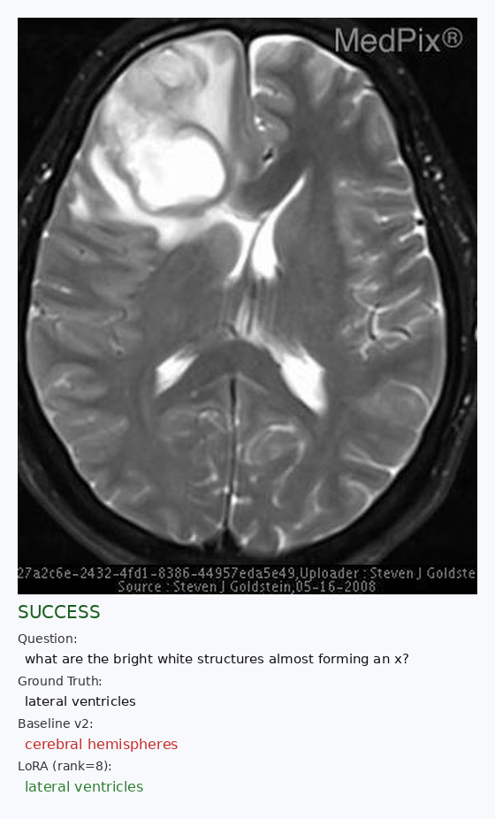
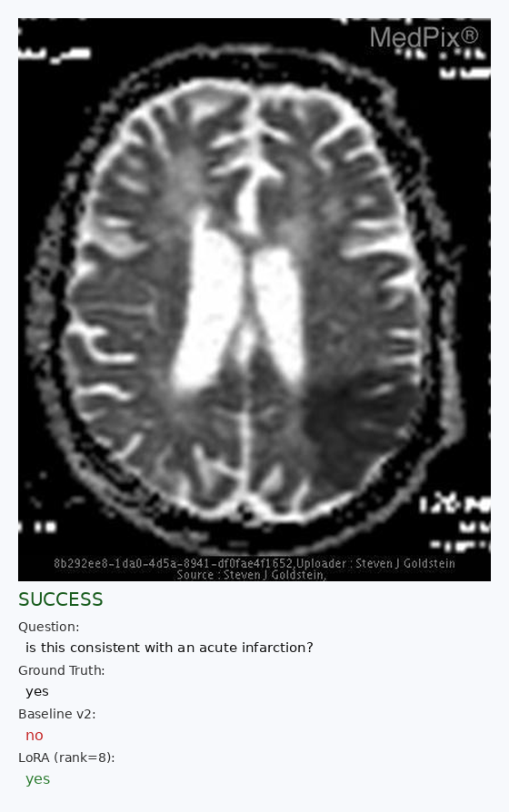
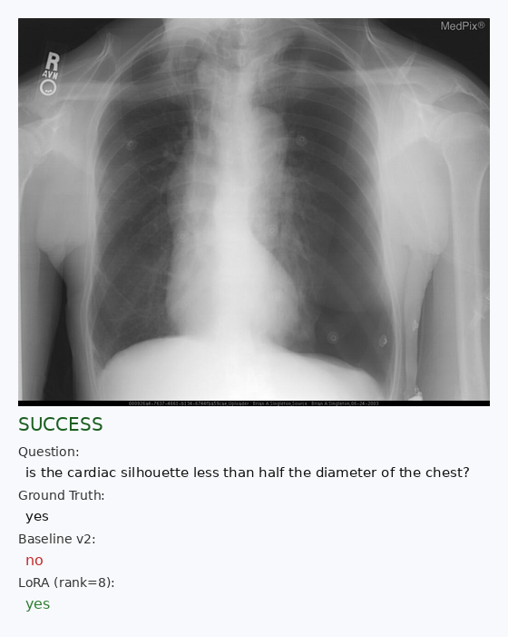
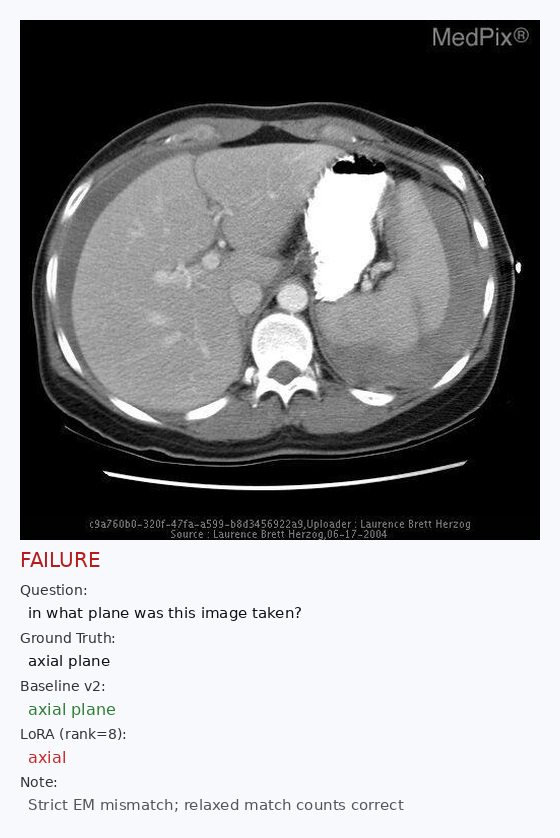
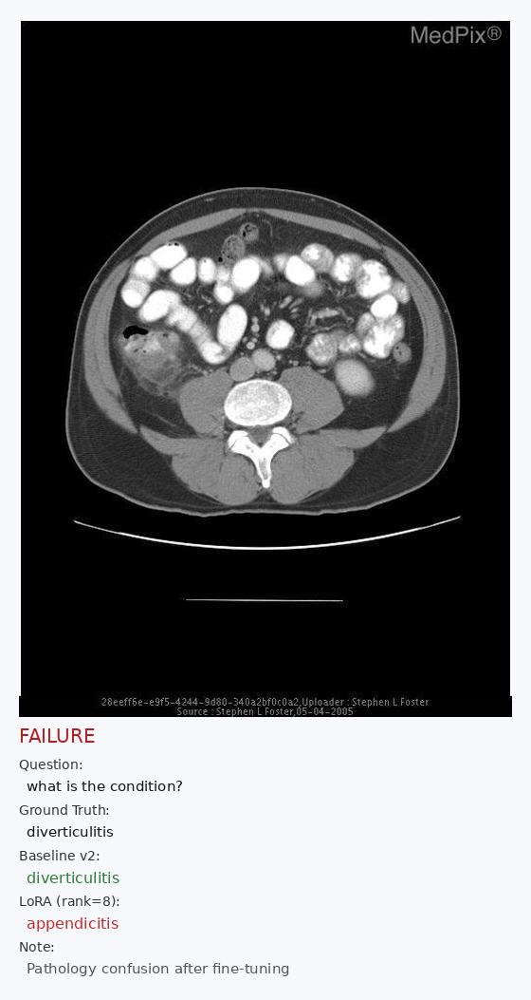

# 医学视觉问答：InternVL2-8B + LoRA

在 **VQA-RAD** 数据集上对 **InternVL2-8B** 进行放射学视觉问答（VQA）微调。  
冻结视觉编码器（InternViT），对语言模型（InternLM2）施加 **LoRA**，评估统一使用 **prompt v2**（yes/no 与短答分流）。

完整实验记录见 [EXPERIMENT_LOG.md](EXPERIMENT_LOG.md)。

---

## 主要结果（test 450，prompt v2）

| 模型                     | Closed EM（严格） | Closed EM（宽松） | Open BLEU-1 | Open ROUGE-L |
| ------------------------ | ----------------: | ----------------: | ----------: | -----------: |
| InternVL2-8B 零样本      |             52.1% |                 — |       0.274 |        0.324 |
| **+ LoRA SFT（rank=8）** |         **63.1%** |         **67.9%** |   **0.320** |    **0.386** |
| 相对 baseline 提升       |      **+11.0 pp** |          +4.8 pp* |      +0.046 |       +0.062 |

\*宽松 EM 在同义词与词边界包含规则下计算，详见 [EXPERIMENT_LOG.md](EXPERIMENT_LOG.md) §5.4。

**正式权重：** `checkpoints/internvl2-vqa-lora/adapter/`（约 37 MB）

---

## 方法概述

```
InternVL2-8B
├── vision_model (InternViT)     ← 冻结
├── mlp1 (projector)             ← 冻结
└── language_model (InternLM2)   ← LoRA（rank=8, alpha=16）
        目标模块: attention.wqkv, attention.wo, feed_forward.w1/w2/w3
```

| 配置项             | 数值                 |
| ------------------ | -------------------- |
| 训练 / 验证 / 测试 | 1570 / 224 / 450     |
| Epoch              | 3                    |
| 有效 batch         | 16（2 × 梯度累积 8） |
| 学习率             | 2e-4，cosine         |
| 可训练参数         | 约 18.9M（0.24%）    |

**负向消融（勿用于正式部署）：** LoRA + mlp1 projector、LoRA rank=16 + early stopping，val EM 均低于 rank=8 主实验。

---

## 快速开始

### 1. 数据准备

```bash
cd /root/autodl-tmp/VQA
bash scripts/download_vqa_rad.sh          # 可选：国内镜像下载
python3 scripts/preprocess_vqa_rad.py
python3 scripts/build_train_json.py
```

**InternVL2-8B**下载：

```bash
# ModelScope（国内更快）
pip install modelscope
python -c "from modelscope import snapshot_download; snapshot_download('OpenGVLab/InternVL2-8B', cache_dir='./models')"
```

将 **InternVL2-8B** 放置在 `models/OpenGVLab/InternVL2-8B`。

### 2. 零样本 Baseline

```bash
python3 scripts/baseline_infer_v2.py --limit 0
```

### 3. LoRA 训练

打开 [`train_lora.ipynb`](train_lora.ipynb) 逐格运行，或直接使用已保存的 adapter。

### 4. 评估

```bash
# 严格指标
python3 scripts/eval_lora.py \
  --lora-path checkpoints/internvl2-vqa-lora/adapter \
  --test-file data/vqa_rad_test.jsonl \
  --predictions-file lora_test_predictions.jsonl \
  --metrics-file lora_test_metrics.json

# 严格 + 宽松 closed EM
python3 scripts/eval_lora.py \
  --lora-path checkpoints/internvl2-vqa-lora/adapter \
  --test-file data/vqa_rad_test.jsonl \
  --relaxed-metrics \
  --metrics-file lora_test_metrics_relaxed.json
```

---

## 项目结构

```
VQA/
├── README.md
├── EXPERIMENT_LOG.md
├── train_lora.ipynb              # 主训练（rank=8）
├── train_lora_mlp1.ipynb         # 消融：+ mlp1
├── train_lora_r16.ipynb          # 消融：rank=16 + early stopping
├── data/
│   ├── vqa_rad_{train,val,test}.jsonl
│   ├── train_internvl.json
│   └── images/
├── scripts/
│   ├── preprocess_vqa_rad.py
│   ├── build_train_json.py
│   ├── baseline_infer_v2.py
│   ├── eval_lora.py
│   ├── internvl_sft_utils.py
│   ├── vqa_common.py             # 含 relaxed_match 指标
│   └── export_lora_from_checkpoint.py
├── checkpoints/internvl2-vqa-lora/adapter/
├── outputs/
└── docs/examples/                # README 样例图
```

---

## 定性样例（测试集）

以下 3 个案例为 **Baseline v2 答错 → LoRA 答对**：

### 成功案例 1 — 解剖结构识别



### 成功案例 2 — yes/no 临床判断



### 成功案例 3 — 胸片征象



以下 2 个案例展示 **失败模式与局限**：

### 失败案例 1 — 答案格式（严格 EM）

Baseline 与数据集字面一致（`axial plane`），LoRA 给出更短同义表述（`axial`）。严格 EM 计错，宽松匹配可计对。



### 失败案例 2 — 病理诊断混淆

微调后 LoRA 将相关疾病名称搞混（`diverticulitis` → `appendicitis`）。



---

## 环境依赖

- Python 3.12+
- PyTorch 2.5+（CUDA）
- `transformers`、`peft`、`timm`、`pillow`
- 建议 GPU 显存 ≥40 GB（实验使用 A800 80GB）

---

## 数据集与基座模型

- **VQA-RAD：** [flaviagiammarino/vqa-rad](https://huggingface.co/datasets/flaviagiammarino/vqa-rad)
- **InternVL2-8B：** [OpenGVLab/InternVL2-8B](https://huggingface.co/OpenGVLab/InternVL2-8B)

---

## 许可说明

请遵守 VQA-RAD、InternVL2-8B 及相关依赖的许可协议。本仓库为研究代码与实验产物。
